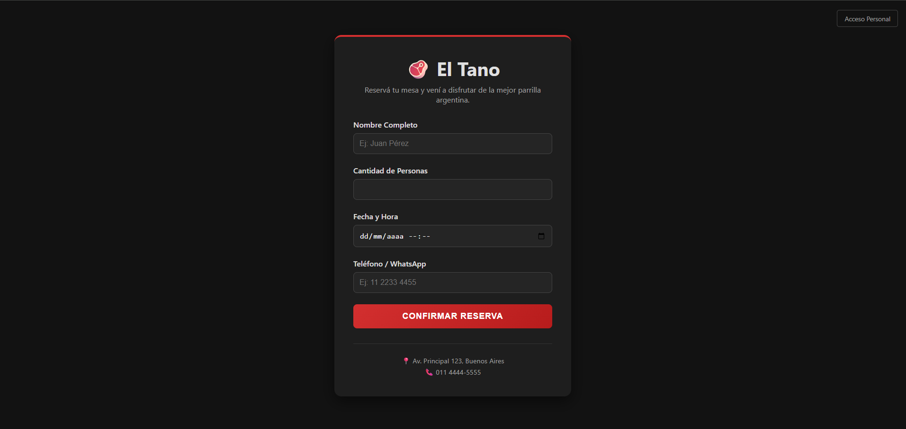
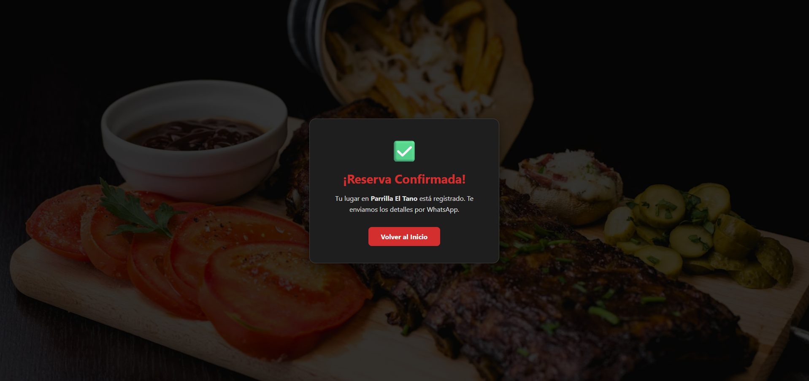
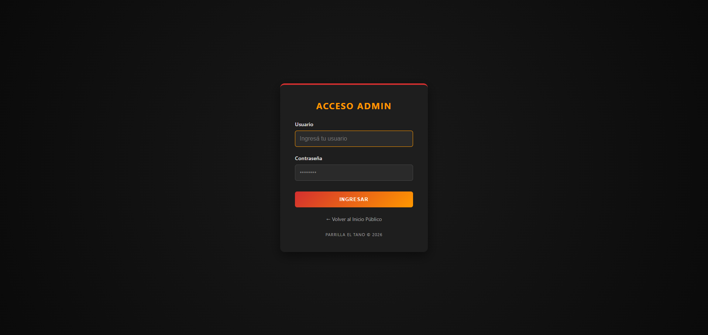
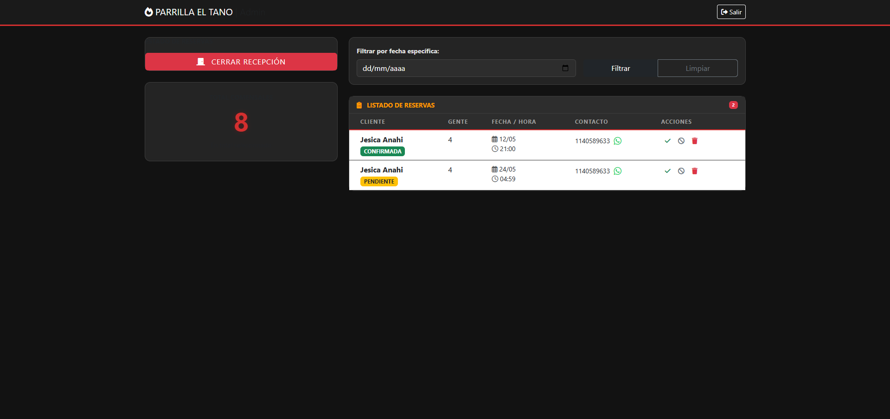

# 🥩 Parrilla El Tano - Sistema de Gestión de Reservas

Sistema integral de gestión de reservas desarrollado para optimizar la operación de una parrilla local. El proyecto abarca desde la experiencia del cliente (reserva online) hasta el control administrativo total (confirmación, estados y métricas).

## 🚀 Estado del Proyecto
* **Estado**: ✅ Finalizado / Listo para Producción Local.
* **Arquitectura**: 3 Capas (Controller -> Service -> Repository).

## 🛠️ Stack Tecnológico
* **Backend**: Java 21 + Spring Boot (Spring Security, Spring Data JPA).
* **Frontend**: HTML5, CSS3, Thymeleaf con diseño responsivo.
* **Base de Datos**: MySQL para desarrollo local (preparado para PostgreSQL en la nube).

## ⚙️ Funcionalidades Principales

### 👤 Para el Cliente
* **Formulario de Reserva**: Interfaz intuitiva para registrar fecha, hora y cantidad de comensales.
* **Integración con WhatsApp**: Generación dinámica de mensajes para confirmación directa con el local.

### Vista del Cliente

### Confirmacion de la reserva del Cliente

### 🔑 Para el Administrador
* **Panel de Control Protegido**: Acceso restringido mediante Spring Security con roles de administrador.
* **Gestión de Estados**: Ciclo de vida completo de la reserva (PENDIENTE, CONFIRMADA, CANCELADA).
* **Dashboard de Métricas**: Contador dinámico de comensales filtrado por fecha para previsión de insumos.
* **Botón de Pánico (Switch Maestro)**: Capacidad de habilitar o deshabilitar el sistema de reservas públicas instantáneamente.

### Login del Administrador

### Dashboard del Administrador

## 📋 Bitácora de Desarrollo (Hitos Técnicos)
* **Día 1-2**: Estructura base, configuración de Spring Initializr y CRUD inicial de reservas.
* **Día 3-4**: Implementación de lógica de negocio compleja, validaciones de fecha/hora y seguridad robusta (BCrypt).
* **Día 5**: Ejecución de auditoría rigurosa de 12 puntos de calidad, saneamiento de base de datos y blindaje de rutas de seguridad.

## 📦 Estructura del Repositorio
El código sigue las mejores prácticas de organización:
* `src/main/java/com/reservas/eltano/config`: Configuraciones de Seguridad y DataInitializer.
* `src/main/java/com/reservas/eltano/model`: Entidades normalizadas (Reserva, Usuario).
* `src/main/resources/templates`: Vistas dinámicas con Thymeleaf.
* `.gitignore`: Configuración profesional para excluir archivos temporales y sensibles.

## 🔑 Credenciales por Defecto
El sistema cuenta con un `DataInitializer` que crea el primer acceso automáticamente:
* **Usuario**: `admin`
* **Contraseña**: `admin123`

---
*Proyecto desarrollado por GusWebDev*